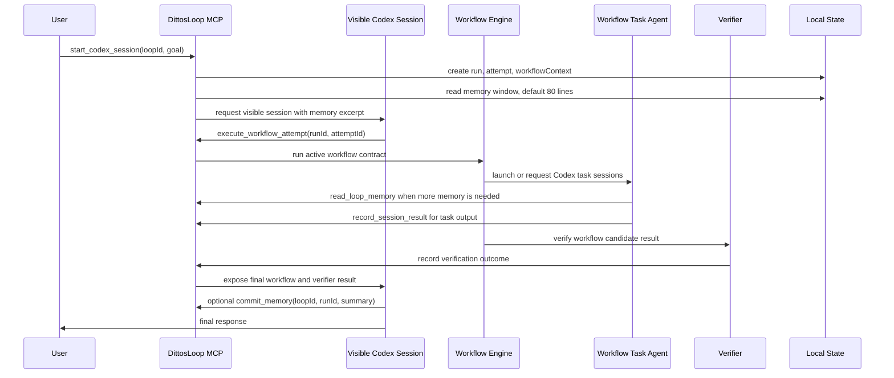

# Loop Memory Session Ownership Design

## Status

Design approved in conversation. This written spec is ready for review before implementation planning starts.

## Problem

`DittosLoop For Codex` now uses the session-first runtime: `start_codex_session` creates the visible Codex session, and that session calls the local workflow engine. Workflow execution and verification are formal enough, but long-term memory still has an unclear ownership rule.

The current runtime exposes `commit_memory`, but it does not say who should decide whether a verifier result deserves durable memory. If every workflow task or the verifier itself needs to understand memory policy, the responsibilities blur:

- workflow tasks should produce work, not curate durable loop memory
- the verifier should judge the candidate result, not decide what the loop should remember
- the visible Codex session already sees the user intent, workflow result, verifier outcome, repair attempts, and final response, so it is the best place to decide whether memory should be written

Memory also needs a bounded read path. A long-lived loop can accumulate enough memory to overload a session prompt unless startup reads are capped and further reads are explicit.

## Goals

- Make the top-level visible Codex session the owner of the memory write decision.
- Place the normal memory decision after the verifier outcome is known.
- Keep workflow task agents and verifier logic free from memory write policy.
- Let every active agent, including workflow task agents, read loop memory through an explicit tool when needed.
- Read only the first memory window at loop start, with a default limit of 80 memory lines.
- Store and present memory newest-first, so the most recent durable learning appears at the top.
- Add a truncation notice when a read returns only part of memory.
- Preserve explicit `commit_memory`; do not add hidden automatic memory writes.

## Non-Goals

- Do not make memory commit a workflow step.
- Do not require the verifier to call memory tools.
- Do not require every run to write memory.
- Do not add model-based automatic memory extraction inside the runtime.
- Do not enforce task-agent write permissions in this change. The installed skill and prompt define the discipline; future host-level tool restrictions can harden it.

## Ownership Rule

The normal run lifecycle is:



The top-level visible Codex session makes the memory decision after the verifier result is visible and before it gives the final user-facing answer. In paths where the runtime has already marked the run completed as part of `record_session_result`, the session may still call `commit_memory` afterward with the completed `runId`; the memory commit remains attached to that run.

Workflow task agents may read memory while working. They should not be responsible for deciding what becomes long-term loop memory. If a task finds a potentially durable lesson, it should include that observation in its task result. The top-level session then decides whether to commit it.

The verifier may report facts, failures, and repair guidance. It should not write memory directly.

## Startup Memory Window

`start_codex_session` should include a bounded memory excerpt in the generated visible-session prompt.

Default behavior:

- `limit`: 80 memory lines
- `offset`: 0
- order: newest-first
- source: the loop's durable memory, not run-local event history

If memory has more content than the returned window, the prompt should include a continuation notice after the excerpt:

```text
还有 X 条记忆未读取。可调用 read_loop_memory({ loopId: "...", offset: N, limit: 80 }) 继续读取。
```

For this design, one stored memory line is one memory entry for read-window and truncation purposes. Future implementations may introduce richer memory entry objects, but the MVP should keep the file format simple and line-oriented.

If a loop has no memory, the prompt should say that there is no durable memory yet and should still mention that `commit_memory` is available after verification when there is a reusable lesson.

## Memory Ordering

New memory entries should be written to the top of `memory.md`.

Expected rendered shape:

```markdown
Latest durable lesson.
Previous durable lesson.
Older durable lesson.
```

`commit_memory` remains append-only at the audit-record level, but the readable memory surface is newest-first:

- `memory.md` renders newest-first
- `read_loop_memory` returns newest-first windows
- reconstructed memory from `memoryCommits` sorts by `createdAt` descending when no explicit `loopMemories.content` exists
- new commits prepend above any existing memory content

Existing stored memory content should not be guessed or reversed during migration. If old content exists, new commits appear above it.

## MCP Tool: `read_loop_memory`

Add a tool available to the visible Codex session and workflow task agents:

```ts
read_loop_memory({
  loopId: string,
  limit?: number,
  offset?: number
})
```

Input rules:

- `limit` defaults to 80.
- `limit` must be between 1 and 200.
- `offset` defaults to 0.
- `offset` must be zero or positive.

Output shape:

```ts
{
  loopId: string;
  limit: number;
  offset: number;
  returnedLines: number;
  totalLines: number;
  remainingLines: number;
  content: string;
}
```

`content` should include the returned memory lines and the truncation notice when `remainingLines > 0`.

No-memory output should be structured, not an error:

```ts
{
  loopId,
  limit,
  offset,
  returnedLines: 0,
  totalLines: 0,
  remainingLines: 0,
  content: "暂无长期记忆。"
}
```

Errors:

- unknown `loopId` is rejected
- invalid `limit` or `offset` is rejected at schema boundaries

## Skill And Prompt Changes

Update the installed loop skill so the run order is explicit:

1. Start with `start_codex_session`.
2. Use the injected memory excerpt; call `read_loop_memory` only when more durable context is useful.
3. Execute the workflow with `execute_workflow_attempt`.
4. Let workflow tasks read memory as needed, but return durable observations instead of committing memory themselves.
5. Use verifier results to decide whether the run passed, needs repair, needs human input, or failed.
6. After the verifier result is visible, the top-level session decides whether there is a reusable lesson, preference, boundary, repair rule, or workflow insight worth keeping.
7. If yes, call `commit_memory(loopId, runId, summary)`.
8. Give the final user-facing response.

Update `buildCodexSessionPrompt` with:

- a `Loop memory / 长期记忆` section
- the default 80-line memory window
- the truncation notice when applicable
- a clear memory discipline note: write memory only for durable, reusable information; skip one-off progress, transient failures, or raw run ids
- an instruction that task-agent observations should flow back through task results, while the top-level session owns the final memory write decision

Update workflow launch plans or task-session context only as needed to make `read_loop_memory` discoverable. The workflow and verifier payloads should not need embedded memory policy.

## Data Flow

```text
commit_memory
  -> MemoryCommit audit record
  -> prepend summary to loopMemories content
  -> memory.md renders newest-first

start_codex_session
  -> readLoopMemory(loopId, limit=80, offset=0)
  -> inject returned content into visible session prompt

workflow task agent
  -> optional read_loop_memory(loopId, limit, offset)
  -> returns observations through record_session_result

top-level visible session
  -> sees verifier result and task outputs
  -> optional commit_memory
```

## Testing Requirements

Service tests:

- committing two memories renders the second commit above the first in `memory.md`
- `readLoopMemory(loopId)` defaults to 80 lines
- `readLoopMemory(loopId, { limit: 1 })` returns the newest line and reports the hidden remaining count
- an offset read returns the next memory window
- no-memory reads return a structured empty-memory response
- unknown loop ids fail
- `startCodexSessionRun` prompt includes only the default memory window and the continuation notice when memory is longer than the default

MCP tests:

- `read_loop_memory` is registered in the tool list
- schema rejects invalid limits and offsets
- the tool returns newest-first windows and truncation metadata

Skill/prompt tests or snapshot checks:

- the installed loop skill mentions `read_loop_memory`
- the visible session prompt says the top-level session owns the post-verifier memory decision
- the prompt does not instruct workflow tasks or verifier to commit memory directly

Regression checks:

- `commit_memory` remains explicit and callable
- existing runs can still commit memory after completion
- verification and workflow execution stay independent of memory write policy

## Acceptance Criteria

- `start_codex_session` injects a bounded newest-first memory excerpt with a default limit of 80 lines.
- The excerpt includes a continuation notice when memory is truncated.
- `read_loop_memory` is available through MCP for any active agent that needs more memory context.
- `commit_memory` writes new memory at the top of the readable memory surface.
- The installed loop skill and generated visible-session prompt place memory write judgment after verifier results and on the top-level visible Codex session.
- Workflow task agents and verifier logic do not need to understand or execute memory write policy.
- Relevant root and MCP tests pass.
