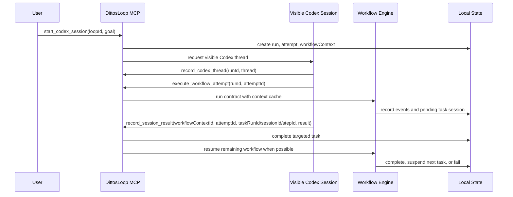

# Session-First Dynamic Workflow Design

## Status

Approved and implemented direction: make `start_codex_session` the only user-visible entry point. A visible Codex session owns the user interaction, and the workflow engine is invoked from inside that session through MCP tools. `start_loop_run` is removed as a tool and removed as a service-level product path; `resume_loop_run` is also removed because resumption now happens by targeted `record_session_result`, linked `resolve_human_request`, and repeated `execute_workflow_attempt` inside the same run/attempt/workflow context.

This design supersedes the user-entry portions of `2026-06-24-live-loop-runtime-redesign.md`.

## Problem

The first Live Loop runtime implementation split the system into two primary paths:

- `start_loop_run`: create an engine-owned run and execute the contract directly.
- `start_codex_session`: create a visible Codex session and later record the session result.

That split does not match the desired local Codex workflow. The user should see one native Codex session, and that session should be able to call the local workflow engine, inspect state, change workflow drafts, promote revisions, and continue the run. The engine remains formal and testable, but it is not the user-facing launcher.

## Goals

- Expose one visible launch path: `start_codex_session`.
- Let Codex sessions call `execute_workflow_attempt` to run the contract inside the existing run/attempt.
- Let Codex sessions call `record_session_result` for exact task/session writeback.
- Resume workflow execution after a targeted task result is recorded.
- Preserve completed step outputs so resumed execution does not spawn duplicate sessions.
- Model Codex work as `task` steps with `runtime: "codex"`; keep legacy `agent` as a compatibility alias.
- Add an explicit Codex subagent specification to workflow steps.
- Add local workflow revision tools so the active Codex session can propose, inspect, promote, or reject workflow changes.
- Show workflow contexts, pending tasks, task sessions, and workflow revisions in the preview.

## Non-Goals

- Do not add a second user-visible start command.
- Do not require a hosted Dittos service.
- Do not make the preview the source of truth.
- Do not depend on private Codex App APIs from the MCP server. Host-mediated session launch remains the bridge.

## Runtime Shape



## MCP Tools

### Public launch tool

`start_codex_session` creates:

- `LoopRun`
- first `LoopAttempt`
- `WorkflowContext`
- `codexSession.requested`
- `codexSession.launchRequest`

The launch request includes `runId`, `attemptId`, `workflowContextId`, and a plan summary so the visible Codex session can call back into the workflow engine.

### In-session workflow tools

`execute_workflow_attempt` runs a formal workflow against an existing `runId` and `attemptId`. It must never create a second top-level run.

`record_codex_thread` attaches the host-created visible Codex App thread to the top-level run. It is not the per-task session writeback API. Per-task precision is handled by `record_session_result`.

`record_session_result` supports precise targeting by `attemptId`, `workflowContextId`, `taskRunId`, `stepId`, `sessionId`, and `idempotencyKey`. For targeted Codex task results:

- If more executable steps remain, it records the task result and immediately resumes the workflow.
- If the workflow is complete, it records final verification and completes the attempt/run.
- If the task failed or needs human input, it fails or suspends the context according to the result status.
- If multiple locator fields are provided, all of them must identify the same task run; contradictory locators are rejected before mutating state.
- `needs_human` suspends the workflow context and task run without writing completed-step output or task result cache.
- For workflow task results with `needs_human`, the service opens a linked `HumanRequest` carrying `attemptId`, `workflowContextId`, `taskRunId`, `sessionId`, and `stepId` when available.

`resolve_human_request` closes a human request. If the request is linked to a workflow task, it writes the user's response back through `record_session_result` with an idempotency key and resumes the workflow when the remaining steps are executable.

### Removed tools

`start_loop_run` is not exposed through MCP and should not remain as a product-level service method. `resume_loop_run` is not exposed either; repair, continuation, and workflow changes must happen from the visible Codex session through `execute_workflow_attempt`, `record_session_result`, and the workflow revision tools. Tests may keep negative assertions that these handlers are absent.

## Workflow Model

`task` is the preferred spelling for Codex work:

```ts
{
  id: "scan",
  kind: "task",
  runtime: "codex",
  label: "Scan official updates",
  prompt: "Find relevant upstream changes.",
  sessionPolicy: "new"
}
```

`agent` remains accepted for older contracts and is normalized through the same executor path.

Current session policy support is intentionally narrow. `sessionPolicy` may be omitted or set to `"new"` only. `reuse-run` and `reuse-step` are reserved future designs and are rejected at contract validation and MCP schema boundaries.

## Codex Subagent Specification

Workflow steps may include `subagent`:

```ts
export interface CodexSubagentSpec {
  ref?: string;
  role?: string;
  model?: string;
  tools?: string[];
  workdir?: string;
  env?: Record<string, string>;
  permissions?: {
    filesystem?: "read-only" | "workspace-write" | "danger-full-access";
    network?: "enabled" | "disabled";
  };
  timeoutMs?: number;
  context?: Record<string, unknown>;
}
```

The runtime stores this spec in the execution plan, persists it on `WorkflowTaskRun`, exposes it in preview/API detail, and passes it through the session bridge request. The current bridge may only ask the visible Codex session to honor it; DittosLoop records and transports `subagent.tools` and permission hints, but does not itself enforce a tool allowlist. The contract shape is explicit enough for a future native Codex subagent launcher.

## Resumable Execution

`WorkflowContext` is the resumability boundary:

- `steps[stepId].status`
- `steps[stepId].output`
- `taskRuns[taskRunId]`
- `pendingSessionIds`
- `cursor`
- `idempotencyKeys`

When `execute_workflow_attempt` starts, it builds a completed-step output cache from the workflow context. The engine returns cached output for completed `task`/`agent` steps instead of launching a new Codex session. This allows a workflow to continue after suspension, including parallel fan-in where some children already completed and others are still pending.

Persisted local state is the restart boundary. A fresh service instance can read the stored `WorkflowContext`, accept a targeted `record_session_result` for the pending task, reuse completed-step output, and continue the same run/attempt without relaunching completed work.

Completed workflow contexts are replay-safe: a later `execute_workflow_attempt` for the same run/attempt returns the existing run and does not reopen task sessions.

Suspended contexts run against their stored `contractSnapshot`, not whatever contract is active at the time of resumption. This keeps in-flight work stable even if a workflow revision is promoted while a task session is waiting.

Parallel execution uses an all-settle barrier. If multiple Codex task branches suspend, the engine waits until all sibling branches have either suspended, completed, or failed before returning control. On final fan-in, synthetic completion events close open parallel blocks so preview history remains coherent.

## Workflow Revisions

The active Codex session can edit the local workflow through revision tools:

- `propose_workflow_revision(loopId, patch, rationale)`
- `list_workflow_revisions(loopId)`
- `promote_workflow_revision(loopId, revisionId)`
- `reject_workflow_revision(loopId, revisionId, reason)`

Revisions are immutable records. Only one promoted revision becomes the active contract. Draft and rejected revisions remain visible in preview for auditability.

## Acceptance Checks

- `start_codex_session` is the only MCP launch tool for user-visible runs.
- `start_loop_run` and `resume_loop_run` remain absent from MCP handler registration and service product APIs.
- The generated Codex session prompt includes `runId`, `attemptId`, `workflowContextId`, and instructs the session to call `execute_workflow_attempt`, `record_session_result`, and workflow revision tools.
- `record_session_result` accepts precise `taskRunId`-only writeback by resolving the original session and step from workflow context.
- `resolve_human_request` resumes a linked suspended workflow task by writing the user response back as the task result.
- Contradictory task result locators are rejected without changing workflow context.
- Parallel fan-in resumes exactly once after all pending sibling sessions complete.
- Parallel suspension uses an all-settle barrier so sibling pending sessions are recorded before the call returns.
- Suspended workflows resume from persisted state after service restart without relaunching completed steps.
- Promoted workflow revision records keep their original contract snapshots immutable while the active formal contract receives the promotion timestamp.
- Suspended workflow contexts continue from their launch snapshot after a revision is promoted.
- Completed workflow contexts are idempotent and do not relaunch task sessions on repeated execution.
- `sessionPolicy` only accepts `"new"` in the current public contract.

## Preview Requirements

Run detail must show:

- visible Codex session request/thread state
- workflow context status and cursor
- task run status, session id, and step id
- task run `subagent` role/model/tool/permission metadata when present
- pending sessions
- workflow revision status and the promoted active revision
- engine events grouped by phase/parallel/task

## Acceptance Criteria

- `rg "start_loop_run|startLoopRun|resume_loop_run|resumeLoopRun"` has no product-path hits outside stale-history docs or negative tests.
- MCP handler definitions do not include `start_loop_run` or `resume_loop_run`.
- Service tests prove a two-step Codex workflow suspends on the first task, records its result, then resumes to the second task without relaunching the first task.
- Parallel task tests prove completed children are not relaunched after resume.
- Contract tests validate `task.runtime = "codex"` and `subagent` fields.
- MCP tests cover revision tools and precise session writeback.
- Preview tests cover workflow contexts, cursor, task runs, pending sessions, promoted revisions, and grouped engine events.
- `npm test` and `npm run check` pass in `plugins/dittosloop-for-codex/mcp`.
