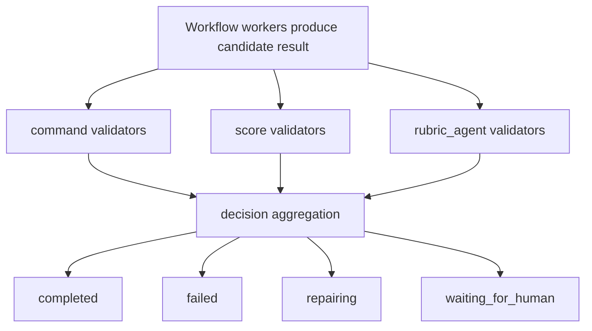

# Verification V2 Design

Review status: draft for user review.

## Problem

The current formal loop contract models verification as a small set of rubrics:

```ts
verification: {
  mode: "after_workflow" | "after_each_agent";
  rubrics: VerificationRubric[];
}
```

That shape is too narrow for real loop validation. It treats rubrics as the center of verification, but DittosLoop needs to support several different validation mechanisms:

- deterministic development checks such as `npm test`, `npm run build`, lint, typecheck, and integration scripts
- direct score checks such as coverage, quality scores, count thresholds, or other structured metrics
- rubric-based judgment performed by a separate verifier agent

The current runtime also has a weak default: when no verifier is configured, `LoopRunner` marks every rubric as passed. `record_session_result` and `record_verification` trust caller-provided status/check data and do not prove that every required rubric was covered. That makes verification visible, but not authoritative.

Verification v2 replaces the current rubric-first model with a validation pipeline. Workflow workers produce candidate results. Validators inspect those results. A decision layer aggregates validator output into the final run state.

## Goals

- Make verification a first-class pipeline owned by the runtime.
- Separate acceptance criteria from validator execution.
- Support three initial validator types: `command`, `score`, and `rubric_agent`.
- Remove the default auto-pass behavior for formal v2 contracts.
- Prevent workflow workers from completing a v2 run merely by writing `status: "passed"`.
- Preserve enough verification evidence for preview, repair, user review, and later auditing.
- Make failed validation feed repair attempts with concrete evidence and instructions.
- Provide an explicit migration path from v1 rubrics and legacy checks.

## Non-Goals

- Do not build a hosted verifier service.
- Do not add background hidden verification. Runs remain visible and inspectable.
- Do not implement every possible validator type in the first v2 implementation.
- Do not make workflow task agents responsible for final verification.
- Do not make preview state editable or authoritative.
- Do not solve native Codex subagent launch beyond the existing session bridge seam.

## Recommended Architecture

Verification v2 has three layers:

1. `criteria`: human-readable acceptance criteria.
2. `validators`: executable checks that inspect workflow output, artifacts, or prior validator output.
3. `decision`: aggregation rules that decide whether the run passed, failed, needs human input, or should enter repair.



This supersedes the v1 statement that "the verifier turns rubrics and candidate output into a structured decision." In v2, a rubric agent can still do that work, but it is one validator type rather than the whole verifier concept.

## Contract Shape

Formal contracts should require verification v2 for new contracts:

```ts
export interface VerificationPolicyV2 {
  version: 2;
  mode: "after_workflow" | "after_each_step";
  criteria: VerificationCriterion[];
  validators: VerificationValidator[];
  decision: VerificationDecisionPolicy;
}

export interface VerificationCriterion {
  id: string;
  label: string;
  description: string;
  severity: "must" | "should";
}

export type VerificationValidator =
  | CommandValidator
  | ScoreValidator
  | RubricAgentValidator;

export interface VerificationDecisionPolicy {
  requireAllMustCriteriaCovered: boolean;
  failOnMustValidatorFailure: boolean;
  failOnShouldValidatorFailure: boolean;
  requireEvidenceForAgentScores: boolean;
}
```

`criteria` describe what good means. They do not execute anything.

`validators` describe how to check the candidate result. A validator may cover zero, one, or many criteria. Some validators, such as `command`, may validate technical health without mapping directly to a natural-language criterion.

`decision` describes how validator outcomes become a final run decision.

### Validation Rules

Contract validation must reject:

- missing or non-`2` verification version for new formal contracts
- duplicate criterion ids
- duplicate validator ids
- validator references to missing criteria
- empty validator lists
- empty criteria lists when `requireAllMustCriteriaCovered` is true
- `score` validators with invalid threshold/operator combinations
- `command` validators with empty command names, absolute `cwd`, or unsafe shell-only strings
- `rubric_agent` validators with missing `criteriaIds`, invalid score scale, or pass score outside the scale

The mode name changes from `after_each_agent` to `after_each_step` because the current workflow model prefers `task` steps and keeps `agent` as a compatibility alias.

## Validator Types

### Command Validator

`command` validators run deterministic development checks.

```ts
export interface CommandValidator {
  id: string;
  type: "command";
  label: string;
  command: string;
  args?: string[];
  cwd?: "project" | "contract" | { relativeToProject: string };
  timeoutMs: number;
  criteriaIds?: string[];
  severity: "must" | "should";
  parse?: CommandParseSpec;
}

export interface CommandParseSpec {
  kind: "none" | "json";
  metrics?: Record<string, string>;
}
```

Rules:

- The default `cwd` is the contract's `projectBinding.projectPath` when present.
- Commands must run without invoking a shell by default.
- Arguments are separate from the executable name.
- Stdout and stderr are captured as bounded evidence.
- Exit code `0` maps to `passed`; non-zero maps to `failed`.
- If `parse.kind` is `json`, selected metrics can be made available to later `score` validators.

This validator is for checks such as:

- `npm test`
- `npm run build`
- `npm run lint`
- `npm run typecheck`

### Score Validator

`score` validators compare a numeric metric against a threshold.

```ts
export interface ScoreValidator {
  id: string;
  type: "score";
  label: string;
  metric: string;
  source: ScoreSource;
  operator: ">=" | ">" | "<=" | "<" | "==" | "!=";
  threshold: number;
  criteriaIds?: string[];
  severity: "must" | "should";
}

export type ScoreSource =
  | { type: "workflow_result"; path: string }
  | { type: "artifact"; artifactId: string; path: string }
  | { type: "validator_output"; validatorId: string; path: string };
```

Rules:

- The source must resolve to a finite number.
- Missing or non-numeric values fail `must` validators and warn for `should` validators.
- Score validators do not create metrics; they only evaluate metrics produced by workflow output, artifacts, or earlier validators.

Examples:

- coverage lines must be at least `0.8`
- output item count must be at least `5`
- rubric agent average score must be at least `4`

### Rubric Agent Validator

`rubric_agent` validators ask a separate verifier agent to evaluate criteria.

```ts
export interface RubricAgentValidator {
  id: string;
  type: "rubric_agent";
  label: string;
  criteriaIds: string[];
  scoreScale: {
    min: number;
    max: number;
  };
  passScore: number;
  evidenceRequired: boolean;
  severity: "must" | "should";
  allowSelfReview?: boolean;
  subagent?: CodexSubagentSpec;
}
```

Rules:

- The verifier agent must be separate from the worker session unless `allowSelfReview` is explicitly true.
- The prompt must include the candidate result, selected criteria, workflow goal, relevant artifacts, and prior failed results when repairing.
- The agent must return structured criterion scores and evidence.
- Missing evidence fails when `evidenceRequired` is true and `requireEvidenceForAgentScores` is enabled.
- Low scores create failed criterion results and can provide repair instructions.

The first implementation can run this through the existing session bridge. It does not need private Codex APIs.

## Verification Result Model

The persisted result should keep validator-level evidence and criterion-level judgments.

```ts
export interface VerificationResultV2 {
  id: string;
  version: 2;
  runId: string;
  attemptId?: string;
  status: "passed" | "failed" | "needs_human" | "skipped";
  summary: string;
  validatorResults: ValidatorResult[];
  decision: AggregatedVerificationDecision;
  createdAt: string;
}

export type ValidatorResult =
  | CommandValidatorResult
  | ScoreValidatorResult
  | RubricAgentValidatorResult;

export interface BaseValidatorResult {
  validatorId: string;
  type: VerificationValidator["type"];
  label: string;
  status: "passed" | "failed" | "warning" | "skipped" | "needs_human";
  severity: "must" | "should";
  evidence?: string;
  criteriaResults?: CriterionResult[];
}

export interface CriterionResult {
  criterionId: string;
  status: "passed" | "failed" | "warning" | "skipped" | "needs_human";
  score?: number;
  maxScore?: number;
  evidence?: string;
}

export interface AggregatedVerificationDecision {
  status: "passed" | "failed" | "needs_human";
  failedCriterionIds: string[];
  failedValidatorIds: string[];
  warnings: string[];
  repairInstructions?: string;
  humanQuestion?: string;
}
```

`VerificationResult.checks` is replaced for v2. Compatibility projections may expose legacy checks in API responses, but persisted v2 data must not collapse back to `{ name, status, output }`.

## Runtime Flow

1. `start_codex_session` creates the visible run, attempt, and workflow context.
2. The visible session calls `execute_workflow_attempt`.
3. The workflow engine runs production steps and collects candidate output.
4. The verification runner loads `contract.verification`.
5. The runner executes deterministic validators first: `command`, then `score` validators whose sources are already available.
6. The runner executes `rubric_agent` validators through the session bridge when needed.
7. Remaining score validators that depend on validator output run after their source validators finish.
8. The decision aggregator creates the final verification decision.
9. The service records a v2 verification result and emits verification lifecycle events.
10. The service completes, repairs, fails, or waits for human input according to the decision and repair policy.

By default, must failures do not short-circuit later validators. Continuing to run later validators produces better repair evidence. A future optimization may allow explicit `stopOnMustFailure`, but v2 should start with evidence completeness.

## Event Model

Engine events should become more specific:

```ts
type VerificationEngineEvent =
  | { type: "verification_started"; runId: string; attemptId: string }
  | { type: "validator_started"; runId: string; attemptId: string; validatorId: string; validatorType: string }
  | { type: "validator_done"; runId: string; attemptId: string; result: ValidatorResult }
  | { type: "verification_decided"; runId: string; attemptId: string; decision: AggregatedVerificationDecision }
  | { type: "verification_done"; runId: string; attemptId: string; result: VerificationResultV2 };
```

The preview should render validator events under a verification section. Repair and human request events remain separate timeline sections.

## MCP Tool Changes

### `create_loop_contract`

`create_loop_contract` should accept only verification v2 for new formal contracts. The old v1 shape is rejected at schema boundaries.

### `execute_workflow_attempt`

`execute_workflow_attempt` becomes the normal path for workflow completion and final verification. It must not complete a v2 run before the verification runner has produced a final decision.

### `record_session_result`

`record_session_result` remains the writeback tool for workflow task sessions. For v2 runs, a task result with `status: "passed"` completes only that task or workflow context. It does not create final verification by itself.

If workflow execution is complete after a task result, the service resumes `execute_workflow_attempt` and enters verification. The final run state comes from v2 validation, not from the worker's self-reported result status.

### `record_validator_result`

Add a dedicated tool for asynchronous validator writeback:

```ts
record_validator_result({
  runId,
  attemptId,
  workflowContextId,
  validatorId,
  idempotencyKey,
  result
})
```

This is used by rubric agent sessions and future external validators. The service must validate that the validator id belongs to the active contract snapshot and that locator fields identify the same run/attempt/context.

### `record_verification`

`record_verification` should be removed from the v2 happy path. If kept for compatibility, it should reject v2 runs unless the input carries a complete `VerificationResultV2` produced by trusted runtime code. The product behavior should not rely on arbitrary callers directly setting final verification status.

## Repair Flow

When the decision is failed:

1. `shouldRepair` receives the aggregated decision, not a flat rubric decision.
2. If attempts remain and strategy is `repair_then_retry`, the workflow context enters `repairing`.
3. The next attempt receives:
   - failed validator ids
   - failed criterion ids
   - command output excerpts
   - score values and thresholds
   - rubric agent evidence
   - repair instructions
4. The repair attempt runs the workflow again and then runs validators again.

V2 keeps the current `repairPolicy.maxAttempts` meaning: it is the total number of attempts, including the first attempt. With that meaning, `maxAttempts: 1` means no repair retry and `maxAttempts: 2` means one repair retry. Tests and product copy should make this explicit.

## Migration

V2 is a breaking contract shape, but stored data still needs a deliberate migration path.

### Formal V1 Contracts

V1:

```ts
verification: {
  mode: "after_workflow",
  rubrics: [
    { id, label, requirement, severity }
  ]
}
```

Migrates to:

```ts
verification: {
  version: 2,
  mode: "after_workflow",
  criteria: [
    { id: "source-quality", label: "Source quality", description: "Every key claim cites a source.", severity: "must" }
  ],
  validators: [
    {
      id: "rubric-agent",
      type: "rubric_agent",
      label: "Rubric review",
      criteriaIds: ["source-quality"],
      scoreScale: { min: 0, max: 1 },
      passScore: 1,
      evidenceRequired: true,
      severity: "must"
    }
  ],
  decision: {
    requireAllMustCriteriaCovered: true,
    failOnMustValidatorFailure: true,
    failOnShouldValidatorFailure: false,
    requireEvidenceForAgentScores: true
  }
}
```

### Legacy `verification.checks`

Legacy checks need conservative migration:

- Strings matching simple command patterns such as `npm test`, `npm run build`, `npm run lint`, or `npm run typecheck` become `command` validators.
- Other strings become `criteria` covered by a generated `rubric_agent` validator.
- Ambiguous shell strings are not converted into command validators automatically.

### Stored Verification Results

Old verification results remain readable. Run detail APIs may expose both old and new shapes during transition:

```ts
verificationResults: Array<VerificationResult | VerificationResultV2>
```

Preview code must render both. New v2 runs write only `VerificationResultV2`.

## Workspace Files And Preview

`rubrics.md` should be replaced by `verification.md` for formal v2 loops.

The file should include:

- criteria table with severity, status, and covering validators
- validator results with command, exit code, scores, thresholds, and evidence
- final decision summary
- repair instructions or human question when present

`workflow.json` should include the v2 verification policy. `status.json` should include latest v2 validator and decision summaries.

Preview timeline should group:

- workflow steps
- validator execution
- final verification decision
- repair
- human requests
- run completion

## Security And Safety

Command validators run local commands and need stricter boundaries than rubric checks:

- Execute without shell by default.
- Use argument arrays instead of shell strings.
- Reject absolute command paths unless explicitly allowed later.
- Resolve `cwd` only under the project binding or contract workspace.
- Enforce timeout.
- Bound stdout/stderr evidence size.
- Do not capture or persist environment variables.
- Do not run command validators when no project binding or safe cwd can be resolved.

Rubric agents must not receive secrets by default. Their prompt should include workflow output, relevant artifacts, criteria, and bounded prior evidence, not arbitrary local files.

## Testing Strategy

Tests should be written before implementation.

Contract tests:

- reject v1 verification shape in `create_loop_contract`
- accept v2 criteria, validators, and decision policy
- reject duplicate criterion ids
- reject duplicate validator ids
- reject validators that reference missing criteria
- reject command validators with unsafe command/cwd shapes
- reject score validators with invalid sources or thresholds
- reject rubric agent validators with invalid score scale or pass score

Verifier runner tests:

- command validator exit code `0` passes
- command validator non-zero exit fails
- score validator passes/fails by threshold
- score validator can read metrics from command JSON output
- rubric agent low score fails the covered criterion
- missing required agent evidence fails when configured
- must validator failure causes final failed decision
- should validator failure creates warning when `failOnShouldValidatorFailure` is false
- uncovered must criterion fails when `requireAllMustCriteriaCovered` is true

Service and MCP tests:

- worker `record_session_result(status: "passed")` cannot complete a v2 run without validation
- completed workflow automatically enters verification
- failed must command validator moves run to `repairing` when repair attempts remain
- exhausted repair attempts fail the run
- `record_validator_result` accepts the correct async rubric agent result
- `record_validator_result` rejects wrong attempt/context/validator ids
- v1 formal contracts migrate to v2 criteria and rubric agent validator
- legacy command-like checks migrate to command validators
- old verification results remain readable in run detail

Preview tests:

- run detail timeline includes validator started/done events
- `verification.md` renders criteria, validators, evidence, scores, thresholds, and final decision
- legacy v1 runs still render without crashing

## Acceptance Criteria

- New formal contracts use `verification.version: 2`.
- The current rubric-only v1 schema is rejected for new contracts.
- `LoopRunner` has no no-verifier auto-pass path for v2.
- `record_session_result` no longer acts as final verification for v2 runs.
- `command`, `score`, and `rubric_agent` validators are modeled distinctly.
- Persisted v2 results keep validator ids, criterion ids, scores, thresholds, command exit codes, and evidence.
- Failed must validation feeds repair with concrete failure details.
- V1 contracts and legacy loops have deterministic migration behavior.
- Preview and workspace files expose verification evidence clearly.
- Existing root and MCP tests pass after migration tests are added.
