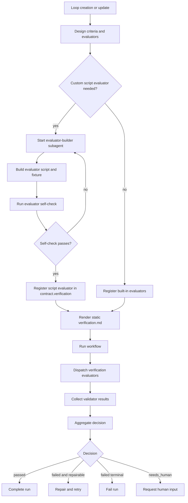

# Verification Flow and Evaluator Architecture Design

Review status: proposed final spec for user review.

## Context

Verification v2 already moved DittosLoop For Codex away from the old rubric-only shape. New formal contracts can express `criteria`, `validators`, and `decision` policy, and the runtime can execute command validators, evaluate score thresholds, wait for rubric-agent writeback, and aggregate results.

The remaining design gap is product-level semantics. A loop author needs to understand how a loop will be evaluated, which evaluator owns each criterion, whether a check is automated or agent-reviewed, what evidence must be produced, and how failures drive repair or human review. Today that information exists in `contract.verification`, but the human-facing `verification.md` is still too close to a latest-result report. Script-based evaluation also needs a distinct build lifecycle: when a loop needs a custom evaluator, a subagent should build and validate the evaluator script before the runtime can rely on it.

This spec defines the full verification flow and logic, not only the markdown rendering.

## Goals

- Make verification an explicit lifecycle from loop creation through evaluator dispatch, result writeback, decision aggregation, repair, and audit.
- Keep `contract.verification` as the authoritative machine-executable verification snapshot for each run.
- Render `verification.md` as a static, human-readable verification design document, not as a latest-run result panel.
- Make evaluators first-class in the product language while preserving compatibility with v2 validators.
- Support script evaluators that are generated by a visible Codex subagent before they are used by the runtime.
- Let verification clearly route each criterion to the right evaluator type: command, script, score, rubric agent, or human review.
- Require evidence for evaluator conclusions where the decision policy says evidence matters.
- Keep run results, scores, evidence, and decisions in run records and preview detail, not in the root `verification.md`.

## Design Decisions

- Use `contract.verification` as the only machine-executable verification definition.
- Keep concrete criteria, evaluator references, thresholds, evidence requirements, and decision policy in the contract because the scheduler and runtime need stable structured data.
- Generate `verification.md` from the contract as the human-readable verification design.
- Do not put latest run results in root `verification.md`.
- Do not create a new `rubrics.md` for verification v2. Rubric-style review is represented as criteria plus `rubric_agent` evaluators.
- Build custom script evaluators before the loop becomes runnable. The builder must be a visible subagent workflow, not hidden background work.
- Treat evidence as required support for a verifier's conclusion, not as the conclusion itself.
- Store dynamic pass/fail state, scores, evidence, repair state, and human-review state in run records and preview detail.

## Non-Goals

- Do not introduce a separate `rubrics.md` for new verification v2 loops.
- Do not make `verification.md` the editable source of truth in this iteration.
- Do not implement a Markdown-to-contract compiler in this iteration.
- Do not allow workflow task agents to self-approve final verification.
- Do not hide evaluator building or verification work in background jobs.
- Do not require every loop to have generated script evaluators.
- Do not replace existing command, score, and rubric-agent validators all at once.

## Vocabulary

- **Criterion**: A requirement the loop result should satisfy. Criteria are marked `must` or `should`.
- **Evaluator**: The product-level checker responsible for one or more criteria.
- **Validator**: The runtime representation of an evaluator in `contract.verification`.
- **Evidence**: The proof behind an evaluator result, such as command output, script findings, cited files, reviewer notes, or structured JSON.
- **Decision policy**: The rules that turn evaluator results into `passed`, `failed`, or `needs_human`.
- **Executable snapshot**: The contract revision and evaluator definitions frozen for a specific run attempt.

## Source Of Truth

The system should use one authoritative machine source and one readable projection:

```text
contract.verification
= executable verification snapshot
= criteria, evaluators/validators, decision policy

verification.md
= static human-readable verification design
= generated from contract.verification
= no latest status, score, evidence, or run decision

run records / preview
= dynamic verification results
= per-run status, scores, evidence, failure reasons, repair state
```

`verification.md` must not contain latest-run state. It answers "how will this loop be verified?" Run detail answers "what happened in this run?"

The runtime must always execute from the contract snapshot. This preserves reproducibility when verification rules change later.

## End-To-End Flow



Verification has two separate phases:

1. **Evaluator preparation** happens when the loop is created or updated. Generated script evaluators are built and validated here.
2. **Evaluator execution** happens after workflow work is ready to verify. The runtime runs deterministic evaluators, waits for async evaluators, and aggregates the final decision.

## Authoring Flow

When creating or updating a loop, Codex should design verification before finalizing the contract:

1. Identify acceptance criteria.
2. Mark each criterion as `must` or `should`.
3. Assign each criterion to one or more evaluators.
4. Choose evaluator type:
   - `command` for existing deterministic commands.
   - `script` for custom generated evaluation logic.
   - `score` for numeric thresholds over existing structured output.
   - `rubric_agent` for qualitative agent judgment.
   - `human` when a human decision is explicitly required.
5. Define required evidence for each evaluator.
6. Define the decision policy and repair behavior.
7. Build generated script evaluators before marking the loop runnable.
8. Render `verification.md` from the finalized verification contract.

The user-facing conversation can stay compact. The formal contract must carry the executable structure.

## Contract Model

The current verification v2 shape remains the foundation:

```ts
export interface VerificationPolicy {
  version: 2;
  mode: "after_workflow" | "after_each_step";
  criteria: VerificationCriterion[];
  validators: VerificationValidator[];
  decision: VerificationDecisionPolicy;
}
```

Product language should refer to evaluators, but the runtime may continue storing them under `validators` until a schema version bump is justified.

### Criteria

```ts
export interface VerificationCriterion {
  id: string;
  label: string;
  description: string;
  severity: "must" | "should";
}
```

Criteria describe what good means. They do not execute anything.

### Decision Policy

```ts
export interface VerificationDecisionPolicy {
  requireAllMustCriteriaCovered: boolean;
  failOnMustValidatorFailure: boolean;
  failOnShouldValidatorFailure: boolean;
  requireEvidenceForAgentScores: boolean;
  requireEvidenceForScriptResults?: boolean;
}
```

The optional script evidence flag can be added when script validators become first-class. Until then, script results can use command evidence plus structured output evidence.

## Evaluator Types

### Command Evaluator

Use `command` when an existing command already represents pass/fail.

Examples:

- `npm test`
- `npm run build`
- `npm run lint`
- `pytest`

Command evaluators should:

- execute without a shell by default
- validate `cwd`, args, and timeout
- capture bounded stdout/stderr as evidence
- pass on exit code `0`
- fail on non-zero exit, timeout, or spawn error

This evaluator is best for existing project health checks, not for custom rubric logic.

### Script Evaluator

Use `script` when the loop needs custom evaluation logic that does not already exist in the project.

Script evaluators are generated by an evaluator-builder subagent and then executed by the runtime.

Recommended shape:

```ts
export interface ScriptValidator {
  id: string;
  type: "script";
  label: string;
  criteriaIds: string[];
  severity: "must" | "should";
  runtime: "node" | "python";
  scriptRef: {
    path: string;
    checksum: string;
    cwd: "loop" | "project" | { relativeToProject: string };
    args?: string[];
    timeoutMs: number;
  };
  input: {
    source: "workflow_result" | "artifact" | "project";
    schema?: Record<string, unknown>;
  };
  output: {
    schema: "verification_result_v1";
  };
  evidenceRequired: boolean;
}
```

For an incremental implementation, a generated script can initially compile down to a `command` validator plus script metadata. The long-term model should make `script` first-class so the runtime can parse structured results.

### Script Evaluator Output

Script evaluators should write structured JSON:

```json
{
  "status": "passed",
  "score": 0.92,
  "summary": "Release notes cover all user-facing changes.",
  "evidence": [
    "Matched 8 of 8 user-facing commits.",
    "Found a breaking-change section."
  ],
  "criteriaResults": [
    {
      "criterionId": "release-note-accuracy",
      "status": "passed",
      "score": 0.92,
      "evidence": "Every user-facing commit is represented."
    }
  ],
  "output": {
    "matchedCommits": 8,
    "totalCommits": 8
  }
}
```

If the script exits non-zero without valid JSON, the runtime records a failed result using stderr/stdout as evidence. If the script returns valid JSON, the runtime should prefer the structured status, score, summary, and evidence.

### Score Evaluator

Use `score` when a numeric value already exists and should be compared with a threshold.

Examples:

- coverage >= 0.8
- Lighthouse performance >= 90
- generated item count >= 5
- error count == 0
- average rubric-agent score >= 4

Score evaluators do not create metrics. They only read numbers from workflow output, artifacts, or prior validator output.

### Rubric Agent Evaluator

Use `rubric_agent` when evaluation requires qualitative judgment.

Rubric-agent evaluators should:

- run separately from workflow task agents
- receive the criteria they cover
- provide score, summary, and evidence
- write results back through `record_validator_result`
- never let workflow workers self-approve final verification

If a rubric-agent result claims `passed` without a required score or evidence, the decision should become `needs_human` or failed according to policy.

### Human Evaluator

Human review should become a first-class evaluator type when the runtime needs explicit user approval.

Until then, human review can be represented through a `rubric_agent` validator that returns `needs_human`, or through the existing human request flow.

## Evaluator Builder Subagent

Generated script evaluators require a visible builder session.

### Builder Responsibilities

The evaluator-builder subagent must:

- read the criterion and expected workflow output
- choose the script runtime
- create the evaluator script
- create at least one fixture or dry-run sample
- define the structured output shape
- run a self-check
- report evidence that the evaluator itself works
- register or update the validator definition

The builder is not the final verifier. It builds the tool that later verifies workflow output.

### Storage

Generated evaluator scripts should be loop-owned by default, not written into the user's project unless explicitly requested.

Recommended virtual layout:

```text
evaluators/<validator-id>/
  evaluator.ts
  fixture.json
  README.md
```

The runtime can store these files under its user data directory and expose them through workspace files. If a script must execute project commands or read project files, the validator should declare that through `cwd`, `projectBinding`, and permissions.

### Activation Rule

A loop with generated script evaluators should not become runnable until every required script evaluator has:

- a script reference
- a content checksum
- a successful self-check
- a valid output schema declaration

If script generation fails, the loop should remain in a visible setup-blocked state instead of failing later at verification time.

## Runtime Verification Flow

After workflow work completes, the runtime enters verification:

1. Load the run, attempt, workflow context, and contract snapshot.
2. Determine whether all workflow work required by the verification mode is complete.
3. Start or resume verification state.
4. Run deterministic evaluators:
   - `command`
   - `script`
   - `score` when its source is available
5. Start or wait for async evaluators:
   - `rubric_agent`
   - `human`
6. Store each validator result exactly once by validator id and idempotency key.
7. Aggregate the decision after all required evaluators have results or a blocking human state exists.
8. Apply repair, human request, fail, or complete transitions.

Repeated scheduler ticks must not rerun completed validators unless a new attempt or new verification revision is created.

## Decision Aggregation

Aggregation should follow these rules:

- Any pending required async evaluator keeps verification waiting.
- Any `needs_human` result makes the decision `needs_human`.
- A failed `must` validator fails the run when `failOnMustValidatorFailure` is true.
- A failed `should` validator warns by default and fails only when `failOnShouldValidatorFailure` is true.
- Uncovered `must` criteria fail when `requireAllMustCriteriaCovered` is true.
- Missing required evidence makes agent or script results invalid.
- Repair is considered only after aggregation produces `failed`.
- Human request is considered when aggregation produces `needs_human`.

The decision object should include:

- final status
- summary
- failed validator ids
- failed criterion ids
- pending or human-required validator ids
- warnings
- repair instructions
- human question when needed

## Evidence

Evidence explains why a result passed or failed.

Evidence examples:

- command stdout/stderr
- script JSON findings
- file paths and matched records
- artifact links
- cited source lines
- agent reviewer notes
- human approval notes

Evidence is used for:

- user trust
- repair instructions
- audit history
- preventing unsupported agent scores
- preview and run detail explanations

The system should treat status and score as conclusions, and evidence as the reason those conclusions are credible.

## `verification.md`

`verification.md` should be generated from `contract.verification` and should not include latest run results.

Recommended structure:

```md
# Verification

## Criteria

| id | severity | description | evaluated by |
| --- | --- | --- | --- |
| tests-pass | must | Project tests pass. | unit-tests |
| quality | must | Output satisfies the user goal. | quality-review |

## Evaluators

### unit-tests
- type: command
- runs: npm test
- evaluates: tests-pass
- evidence: stdout/stderr
- failure effect: must failure fails the run

### quality-review
- type: rubric_agent
- evaluates: quality
- score scale: 0-5
- pass score: 4
- evidence required: true
- failure effect: must failure fails the run

## Decision Policy

- All must criteria require evaluator coverage.
- Must validator failures fail the run.
- Should validator failures warn unless configured otherwise.
- Rubric-agent scores require evidence.
```

Do not render:

- latest status
- latest score
- latest evidence
- latest decision
- waiting/passed/failed runtime state

Those belong in run detail, preview, and verification result records.

## Run Results

Each run should persist verification results separately from the static design.

Run result records should include:

- run id
- attempt id
- verification policy snapshot identity
- validator results
- criterion-level statuses
- evidence
- aggregate decision
- repair/human transition metadata
- timestamps

Preview should show run verification state from these records, not by mutating `verification.md`.

## Repair And Human Review

Repair should be driven by failed verification evidence.

When a run fails and repair attempts remain:

1. Build repair instructions from failed validator summaries and evidence.
2. Start a repair attempt.
3. Reuse the same verification design unless the loop is explicitly revised.
4. Record the new attempt's verification result separately.

When verification needs human input:

1. Create a human request tied to the run, attempt, and validator id.
2. Show the question and available evidence.
3. Resume verification after the human answer is recorded.
4. Preserve the human response as evidence.

## Migration From Current State

Existing v2 contracts remain valid:

- `command` validators keep working.
- `score` validators keep working.
- `rubric_agent` validators keep working.
- existing decision policy remains compatible.

Changes needed by this design:

- Stop rendering latest result state into root `verification.md`.
- Expand `verification.md` into a static evaluator design document.
- Add script evaluator modeling, builder state, and script execution.
- Add run-result rendering in preview/detail if any current UI depends on root `verification.md` for latest verification state.
- Keep legacy `rubrics.md` only for legacy contracts during compatibility migration.

## Testing Strategy

Contract and schema tests:

- accept static verification policies with command, score, rubric-agent, and script evaluators
- reject duplicate ids and missing criterion references
- reject script evaluators without a valid script reference, checksum, timeout, or output schema
- reject active loops with unbuilt required generated evaluators

Evaluator builder tests:

- creating a loop with a generated script evaluator starts a visible evaluator-builder session
- failed builder self-check leaves the loop setup-blocked
- successful builder self-check registers a script evaluator
- changing covered criteria invalidates stale script evaluator checksums or build state

Runtime tests:

- command evaluators run directly and record stdout/stderr evidence
- script evaluators parse structured JSON results
- invalid script JSON fails with process output as evidence
- rubric-agent evaluators wait for writeback
- score evaluators read numeric values from workflow result and prior validator output
- workflow task success cannot complete a v2 run before verification finishes
- must failures fail, should failures warn by default, and missing evidence blocks or fails according to policy

Workspace and preview tests:

- v2 loops expose `verification.md`
- `verification.md` contains criteria, evaluators, evidence requirements, and decision policy
- `verification.md` does not contain latest status, latest score, latest evidence, or latest decision
- run detail still displays validator results, evidence, and aggregate decision

## Risks

- Script evaluators can become unsafe if command, cwd, file access, or dependency installation is not constrained.
- Generated evaluator scripts can drift from criteria unless criteria changes invalidate the script build.
- A script evaluator may be harder to debug than a simple command validator unless self-check evidence is visible.
- Too much contract detail can make loop JSON noisy; `verification.md` should carry readability while contract stays executable.
- Human review and rubric-agent review can overlap; the product language should keep them distinct even if the first implementation shares runtime plumbing.

## Open Implementation Questions

- Should the first script evaluator implementation be a new `script` validator type, or a `command` validator with script metadata?
- Should generated evaluator files be exposed as workspace files only, or also as real files under a documented user data path?
- What exact MCP calls should start and complete evaluator-builder sessions?
- Should a loop be creatable in a draft/setup-blocked state when evaluator generation fails, or should creation fail atomically?
- Should per-run verification reports eventually have a file projection such as `runs/<runId>/verification.md`, separate from root `verification.md`?

## Review Notes

This spec intentionally treats verification as an architecture layer. The immediate implementation can be incremental: first make `verification.md` static and evaluator-focused, then add generated script evaluator build state, then add first-class script execution and structured result parsing.
